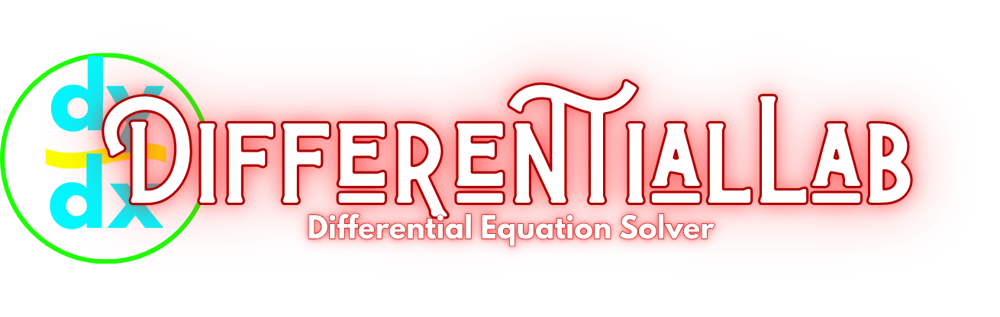

# DifferentialLab Documentation

DifferentialLab is a desktop application for numerical differential-equation workflows:

- ordinary differential equations (ODE)
- recurrence/difference equations
- PDE workflows
- transforms and custom analysis
- specialized plugin-based `complex_problems`

## Documentation Map

### User docs

- [Getting Started](getting-started.md)
- [User Guide](user-guide.md)
- [Complex Problems Guide](complex-problems.md)
- [Configuration Reference](configuration.md)
- [FAQ and Troubleshooting](faq.md)

### Developer docs

- [Architecture](architecture.md)
- [Developer Guide](developer-guide.md)
- [Testing Guide](testing.md)
- [Changelog](changelog.md)

### API docs

- [API Reference](api/index.md)

```{toctree}
:maxdepth: 2
:caption: User Documentation
:hidden:

getting-started
user-guide
complex-problems
configuration
faq
```

```{toctree}
:maxdepth: 2
:caption: Developer Documentation
:hidden:

architecture
developer-guide
testing
changelog
```

```{toctree}
:maxdepth: 2
:caption: API Reference
:hidden:

api/index
```
