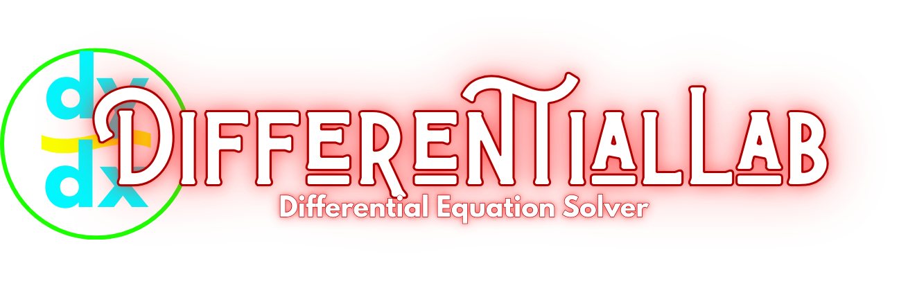

# DifferentialLab Documentation

DifferentialLab is a desktop application for numerical equation and simulation
workflows. The current repository includes:

- scalar ODE solving
- vector ODE systems
- difference and recurrence equations
- 2D PDE workflows
- function transforms
- specialized `complex_problems` plugins
- Sphinx-generated API documentation

## Repository Snapshot

- Version: `0.4.1`
- Python: `>=3.12`
- Predefined equation catalog: 120 entries
- Complex problem plugins: 7 registered modules
- Configuration source of truth: `src/config/env.py`
- Main entry point: `src/main_program.py`

## Documentation Map

### User docs

- [Getting Started](getting-started.md)
- [User Guide](user-guide.md)
- [Complex Problems Guide](complex-problems.md)
- [Configuration Reference](configuration.md)
- [FAQ and Troubleshooting](faq.md)

### Developer docs

- [Architecture](architecture.md)
- [Developer Guide](developer-guide.md)
- [Testing Guide](testing.md)
- [Changelog](changelog.md)
- [Logging Design Note](superpowers/specs/2026-05-03-logging-design.md)

### API docs

- [API Reference](api/index.md)

```{toctree}
:maxdepth: 2
:caption: User Documentation
:hidden:

getting-started
user-guide
complex-problems
configuration
faq
```

```{toctree}
:maxdepth: 2
:caption: Developer Documentation
:hidden:

architecture
developer-guide
testing
changelog
superpowers/specs/2026-05-03-logging-design
```

```{toctree}
:maxdepth: 2
:caption: API Reference
:hidden:

api/index
```
